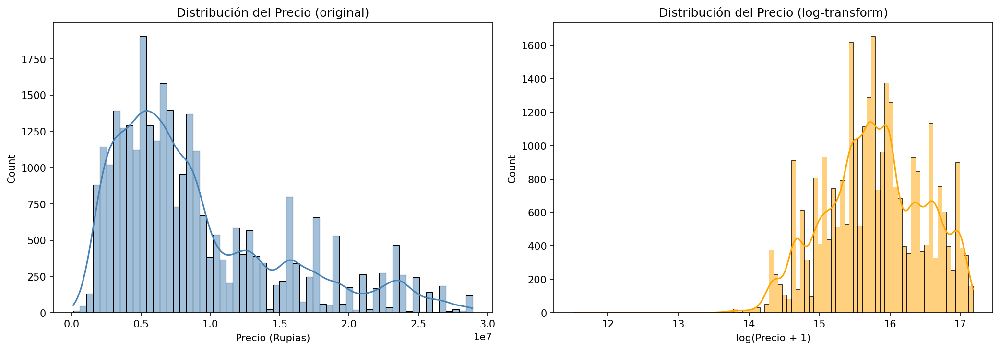
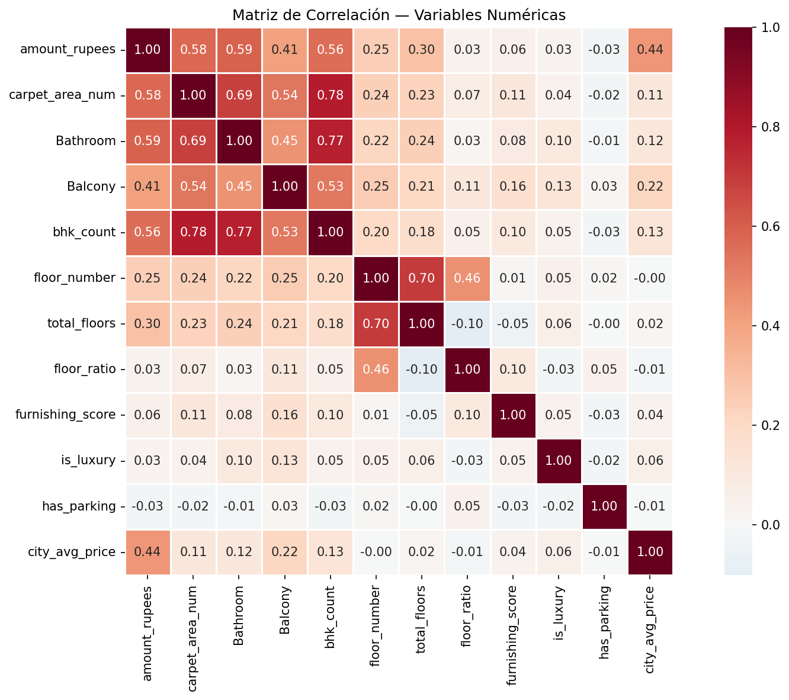
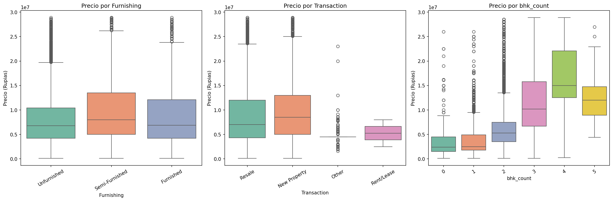
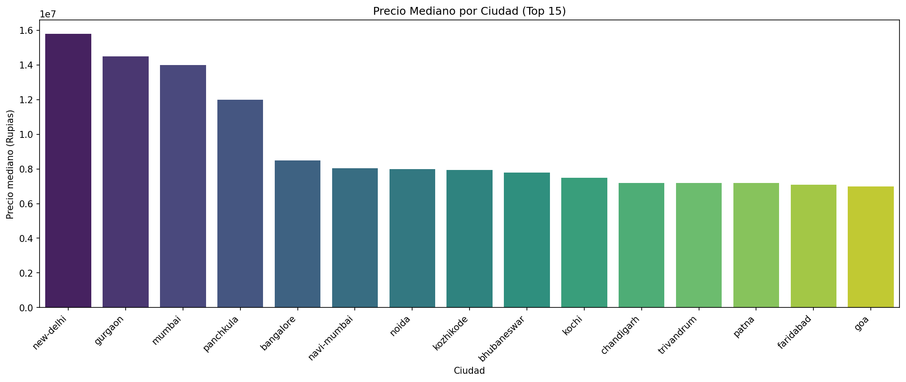
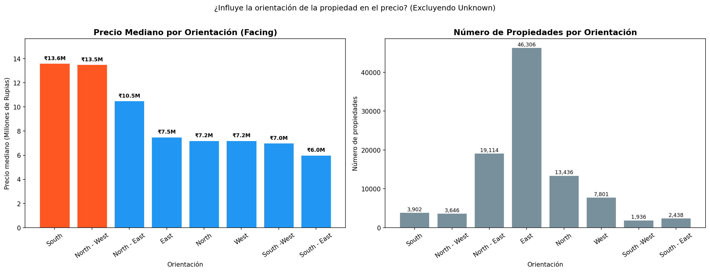
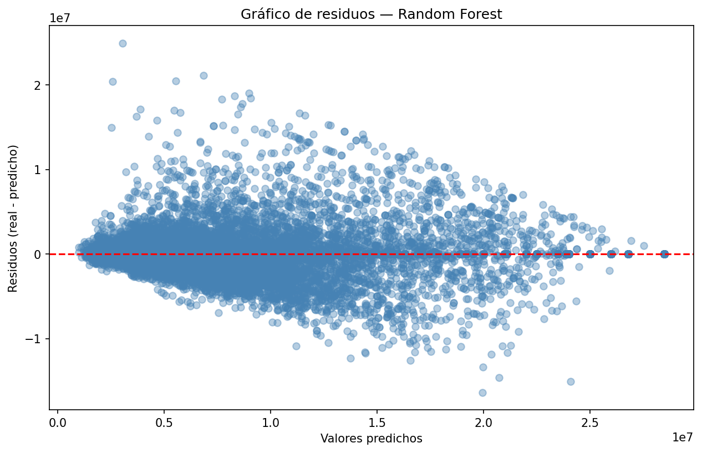
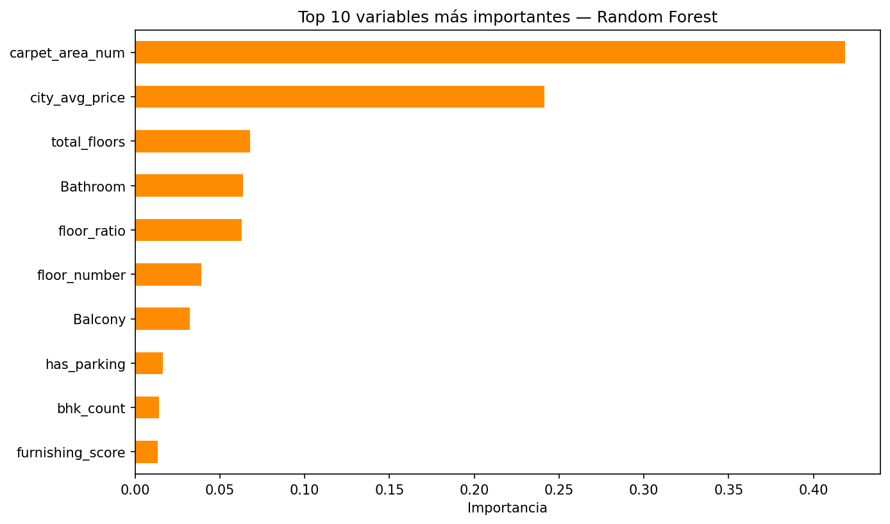
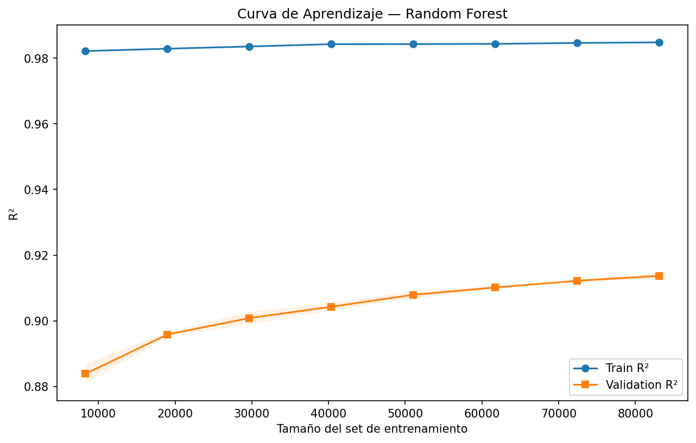
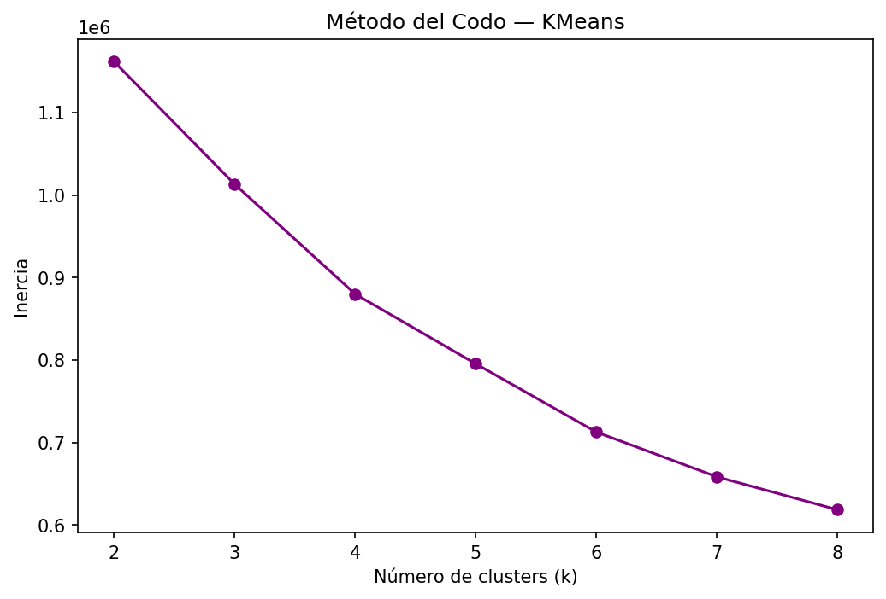

# Reporte de Hallazgos — Análisis de Precios de Propiedades en India

## Dataset
- **Registros totales:** 187,531 propiedades (162,606 tras limpieza de outliers)
- **Ciudades:** 81 ubicaciones en India
- **Período:** Datos históricos de portales inmobiliarios

---

## 1. Hallazgos del EDA

- La distribución del precio es **multimodal y sesgada a la derecha**, con picos naturales alrededor de 5M, 7M, 15M y 22M rupias. Esto no es ruido — refleja la segmentación natural del mercado (propiedades económicas, familiares, ejecutivas y de lujo).
- El log-transform reduce la escala y mejora levemente la simetría, pero no elimina la multimodalidad. Se justifica aplicarlo si se usa un modelo lineal (Ridge), pero no es necesario para Random Forest.
- Se eliminaron outliers de `amount_rupees` y `carpet_area_num` usando el método IQR (límites Q1 - 1.5×IQR y Q3 + 1.5×IQR), eliminando registros con precios o áreas extremadamente atípicos para mejorar la calidad del entrenamiento.

---

## 2. Correlaciones más importantes

Las 3 variables con mayor correlación lineal (Pearson) con el precio son:

| Variable | Correlación con precio |
|---|---|
| Bathroom | 0.59 |
| carpet_area_num | 0.58 |
| bhk_count | 0.56 |
| city_avg_price | 0.44 |

**Importante — correlación vs. importancia en el modelo:** aunque `city_avg_price` tiene la cuarta correlación lineal más alta, es la **segunda variable más importante** en el modelo Random Forest (24% de importancia), superada solo por `carpet_area_num` (42%). Esto se explica porque el Random Forest captura relaciones no lineales que la correlación de Pearson no detecta. La ubicación importa mucho para el modelo aunque su correlación lineal sea menor.

**Respuesta a la hipótesis:** `Bathroom` tiene mayor correlación lineal con el precio que `city_avg_price` (0.59 vs 0.44). Sin embargo, en poder predictivo real (feature importance), `city_avg_price` supera a `Bathroom` (24% vs 6%).

New Delhi (₹15.8M), Gurgaon (₹14.5M) y Mumbai (₹14M) concentran los precios más altos. Hay una caída brusca después del puesto 4, lo que indica que el mercado premium está muy concentrado geográficamente.

**¿Influye la orientación en el precio?** Sí: las propiedades con orientación Sur (₹13.6M) y Noroeste (₹13.5M) son un 127% más caras que las de orientación Sur-Este (₹6M). Contrario a lo que podría suponerse, las casas orientadas al Norte (₹7.2M) no son las más caras — en el mercado indio la orientación Sur está asociada con el Vastu Shastra y mayor luminosidad en invierno. Nota: South y North-West tienen pocas propiedades (3,900 y 3,600), por lo que sus medianas deben interpretarse con cautela estadística. Hay una caída brusca después del puesto 4, lo que indica que el mercado premium está muy concentrado geográficamente.

---

## 3. Desempeño de los Modelos

| Modelo           | MAE       | RMSE       | R²   |
|------------------|-----------|------------|------|
| Random Forest    | 736,441   | 1,808,673  | 0.92 |
| Ridge Regression | 2,993,116 | 4,022,467  | 0.58 |

El Random Forest supera ampliamente a Ridge Regression en todas las métricas. El R²=0.92 indica que el modelo explica el 92% de la varianza en los precios de prueba.

**Observación sobre residuos:** El gráfico muestra heterocedasticidad — el error aumenta para propiedades de precio alto. Esto es esperado: las propiedades caras tienen características más únicas y difíciles de generalizar con el dataset disponible.

**Variables más determinantes (feature importance):**
1. `carpet_area_num` — 42% (el área es el factor dominante)
2. `city_avg_price` — 24% (la ubicación como segunda fuerza)
3. `total_floors`, `Bathroom`, `floor_ratio` — ~6% cada una

**Observación sobre overfitting:** La curva de aprendizaje muestra un Train R²≈0.985 vs Validation R²≈0.915 — una brecha de ~7 puntos. Esto indica **overfitting moderado**: el modelo memoriza parcialmente los datos de entrenamiento. El R²=0.92 en test sigue siendo excelente; para reducir la brecha se podría limitar la profundidad del árbol (`max_depth`) o incrementar `min_samples_leaf`.

---

## 4. Perfiles de Segmentación (Clustering)

El método del codo no muestra un punto de inflexión marcado, lo que indica que los datos no tienen clusters perfectamente definidos. Se eligió k=4 por interpretabilidad del negocio.

Las medianas reales de cada cluster son:

| Cluster | BHK | Área (sqft) | Price/sqft | Amueblado | Ciudad mediana |
|---|---|---|---|---|---|
| 0 — Inversión Económica | 3 | 1,300 | ₹8,087 | Semi | ₹6.9M |
| 1 — Perfil Familiar | 2 | 800 | ₹6,500 | Semi | ₹6.5M |
| 2 — Perfil Ejecutivo | 2 | 688 | ₹5,814 | Sin amueblar | ₹6.9M |
| 3 — Lujo Premium | 2 | 105 | ₹53,488 | Sin amueblar | ₹7.1M |

**Nota:** El Cluster 3 (Lujo Premium) se distingue por un `price_per_sqft` extremadamente alto (₹53,488 vs ~₹6,500 del resto), a pesar de tener área pequeña. Esto corresponde a propiedades en ubicaciones exclusivas de alta demanda donde el precio por metro cuadrado es el factor diferenciador, no el tamaño.

---

## 5. Limitaciones del Modelo

- El modelo presenta overfitting moderado (Train R²=0.985 vs Test R²=0.92); podría beneficiarse de regularización.
- Dataset sin columnas de antigüedad real del inmueble.
- Precios en rupias sin ajuste por inflación ni año de la oferta.
- La columna `location` tiene solo ciudad, sin barrio ni coordenadas GPS.
- `Super Area` y `Society` presentan más del 57% de vacíos, limitando su poder predictivo.
- El modelo no captura condiciones macroeconómicas del mercado.
- El gráfico de residuos muestra heterocedasticidad: el error aumenta para propiedades de precio alto.

---

## 6. Datos que mejorarían la precisión

- Coordenadas GPS (latitud/longitud) para análisis geoespacial y distancia a servicios.
- Año de construcción real del edificio.
- Distancia a metro, escuelas, hospitales, centros comerciales.
- Historial de precios del mismo inmueble.
- Calidad de construcción / materiales.
- Colonia o barrio específico dentro de cada ciudad (actualmente solo se tiene ciudad).
